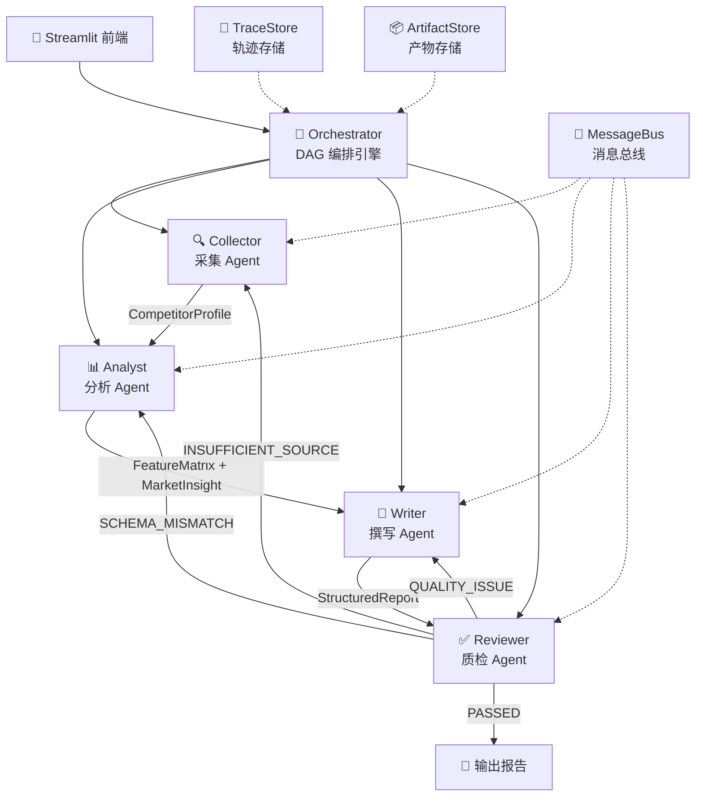
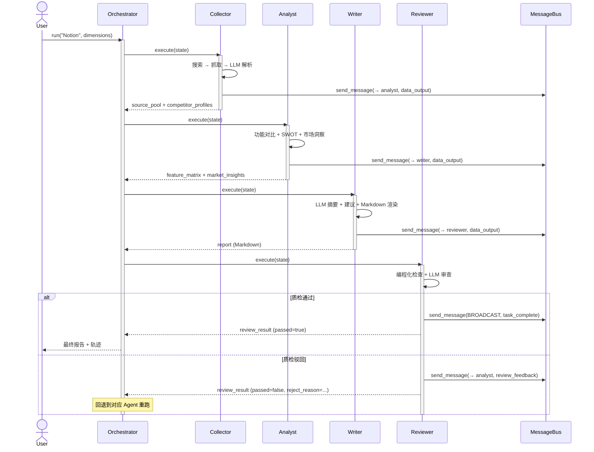

# 系统架构文档

> AI 驱动的竞品分析 Agent 协作系统 — 架构设计与关键技术决策

---

## 一、系统架构总览



## 二、数据流时序



## 三、Agent 数据契约

### 3.1 输入/输出 Schema

| Agent | 输入（从 State 读取） | 输出（写入 State） | 核心 Pydantic Model |
|---|---|---|---|
| Collector | `target_product` | `source_pool`, `competitor_profiles` | `CompetitorProfile` |
| Analyst | `competitor_profiles` | `feature_matrix`, `market_insights` | `FeatureMatrix`, `MarketInsight` |
| Writer | `competitor_profiles`, `feature_matrix`, `market_insights` | `report` | `StructuredReport` |
| Reviewer | `report`, `competitor_profiles`, `feature_matrix`, `market_insights` | `review_result` | `ReviewResult` |

### 3.2 LangGraph State 定义

```python
class AgentState(TypedDict):
    target_product: str                           # 用户输入
    analysis_dimensions: list[str]                # 分析维度
    source_pool: list[dict]                       # Collector 输出：信源池
    competitor_profiles: list[dict]               # Collector 输出：竞品画像
    feature_matrix: Optional[dict]                # Analyst 输出：功能对比
    market_insights: list[dict]                   # Analyst 输出：市场洞察
    report: str                                   # Writer 输出：Markdown
    review_result: Optional[dict]                 # Reviewer 输出：质检结论
    iteration_count: Annotated[int, operator.add] # 质检轮次（自动累加）
    messages: Annotated[list, operator.add]       # 全局消息日志（自动追加）
```

## 四、架构决策记录 (ADR)

### ADR-001：为什么用 TypedDict + Annotated reducer 而非 Pydantic Model 做 LangGraph State？

**背景**：LangGraph 的 `StateGraph` 在节点之间合并状态时，需要知道每个字段的合并策略（覆盖 / 追加 / 累加）。

**决策**：使用 `TypedDict` + `Annotated` reducer 模式。

**理由**：
- LangGraph 原生支持此模式，`Annotated[int, operator.add]` 让 `iteration_count` 自动累加，无需在每个节点中手动 `state["iteration_count"] += 1`
- `Annotated[list, operator.add]` 让 `messages` 自动追加，节点只需返回新消息，不需要读取旧列表再拼接
- Pydantic Model 在 State 更新时需要手动处理不可变字段，增加了节点函数的复杂度
- `TypedDict` 更轻量，不引入 Pydantic 的校验开销（校验由各 Agent 内部的 Pydantic Model 完成）

**代价**：失去了 Pydantic 的运行时校验。补偿措施：每个 Agent 的输入/输出层有独立的 Pydantic 校验。

---

### ADR-002：FeatureMatrix 为什么用 `dict[str, dict[str, str]]` 而非 List 结构？

**背景**：功能对比矩阵的语义是"维度 × 竞品 = 评价"。两种表达方式备选：
- 方案 A：`list[{"dimension": "价格", "competitor": "Notion", "rating": "灵活"}]`（关系型）
- 方案 B：`dict["价格"]["Notion"] = "灵活"`（矩阵型）

**决策**：使用方案 B（dict 矩阵）。

**理由**：
- 矩阵结构更直观地表达"维度 × 竞品"的对比语义，与报告中的表格渲染直接对应
- Writer 生成 Markdown 表格时，dict 的嵌套结构可以减少一次 group_by 转换
- LLM 在 Prompt 中看到 `{"维度": {"竞品A": "评价", "竞品B": "评价"}}` 时，格式理解准确度高于关系型表达

**代价**：
- dict key 的稳定性依赖 LLM 输出的竞品名和维度名与输入一致（字符串精确匹配），LLM 可能产生微小变体（如 "Notion " vs "Notion"）
- 补偿：Reviewer 的 `check_matrix_completeness` 会检测竞品名不匹配，触发 SCHEMA_MISMATCH 回退

---

### ADR-003：Reviewer 为什么采用"编程化检查 + LLM 审查"双轨制？

**背景**：报告质检需要同时满足确定性规则（如"SWOT 章节是否存在"）和语义判断（如"结论是否与数据矛盾"）。

**决策**：双轨并行——编程化检查覆盖确定性规则，LLM 审查覆盖语义判断，结果合并。

**理由**：
- **确定性规则更快、更省 Token**：检查 `competitor_profiles` 是否为空、矩阵竞品名是否匹配等规则，用纯 Python 判断，毫秒级完成，不消耗 LLM 调用
- **不依赖 LLM 稳定性**：编程化检查的结论 100% 确定，不会因为 LLM 输出格式异常而漏报问题
- **LLM 审查覆盖语义盲区**：逻辑矛盾（"SWOT 说价格低，功能对比却说定价偏高"）无法用正则表达，必须由 LLM 理解整篇报告后判断
- **合并判定有清晰优先级**：编程化检查发现问题时，强制将评分压低到 ≤0.6 并不论 LLM 结论如何都标记为 `passed=false`

**代价**：两套逻辑需要分别维护，编程化规则可能遗漏新的错误模式。补偿：Reviewer 的 `issues` 字段同时收集两边的发现，便于发现编程化规则的覆盖盲区。

---

## 五、溯源链路设计

```
用户报告中看到：
  "界面直观易用 [src_001]"
        │
        ▼
  报告末尾 "参考来源" 章节：
  1. [src_001] Notion 官方产品页 (https://notion.so) 置信度 95%
        │
        ▼
  traces/{trace_id}/agents/collector.json：
  {
    "action": "parse_complete",
    "evidence_refs": ["src_001"],
    "output_summary": "生成 CompetitorProfile: 3 功能"
  }
        │
        ▼
  artifacts/{trace_id}/01_collector.json：
  {
    "source_pool": [{
      "source_id": "src_001",
      "source_url": "https://notion.so",
      "source_title": "Notion 官方产品页",
      "confidence": 0.95
    }]
  }
```

**4 层溯源**：报告引用 → 参考来源列表 → Agent 执行日志 → 原始采集数据。每一层都可独立验证。

---

## 六、目录结构与模块职责

```
src/
├── core/
│   ├── schema.py         # Pydantic 竞品知识 Schema + AgentState
│   ├── message_bus.py    # 发布/订阅消息总线（事件驱动、trace_id 注入）
│   └── orchestrator.py   # DAG 编排引擎（LangGraph + 顺序 fallback）
├── agents/
│   ├── base.py           # Agent 基类（LLM 封装、工具注册、执行日志）
│   ├── collector.py      # 采集 Agent
│   ├── analyst.py        # 分析 Agent
│   ├── writer.py         # 撰写 Agent
│   └── reviewer.py       # 质检 Agent
├── tools/
│   ├── web_search.py     # Tavily 搜索工具（含 mock fallback）
│   ├── web_scraper.py    # httpx 网页抓取 + HTML→text
│   └── data_parser.py    # LLM 驱动的非结构化文本→结构化解析
├── models/
│   ├── feature.py        # 功能对比分析器 + Prompt 模板
│   ├── market.py         # 市场洞察构建器 + Prompt 模板
│   ├── report.py         # Markdown 报告渲染器（7 章节）
│   └── review.py         # 质检审查器（编程化规则 + LLM Prompt）
├── storage/
│   ├── trace_store.py    # 执行轨迹持久化（JSON，按 trace_id 组织）
│   └── artifact_store.py # 中间产物持久化（JSON，按阶段编号）
└── api/
    └── routes.py         # Streamlit 前端
```

## 七、技术栈

| 层级 | 技术 | 版本 | 选型理由 |
|---|---|---|---|
| DAG 编排 | LangGraph | >=0.2.0 | 原生条件路由 + State reducer + checkpoint |
| LLM 抽象 | LangChain (OpenAI 兼容层) | >=0.3.0 | 支持 OpenAI / DeepSeek / Anthropic 统一调用 |
| 数据校验 | Pydantic V2 | >=2.5.0 | 严格类型校验 + JSON Schema 导出 |
| 搜索引擎 | Tavily API | >=0.5.0 | 结构化搜索结果 + 高置信度评分 |
| 前端 | Streamlit | >=1.40.0 | Python 原生 UI，零前端依赖 |
| HTTP 客户端 | httpx | >=0.25 | 异步支持 + HTTP/2 |
| 日志 | loguru | >=0.7 | 结构化日志 + 彩色终端输出 |
| 测试 | pytest | >=8.0 | 128 条单元+集成测试 |
| 容器化 | Docker | - | 一键部署 |
