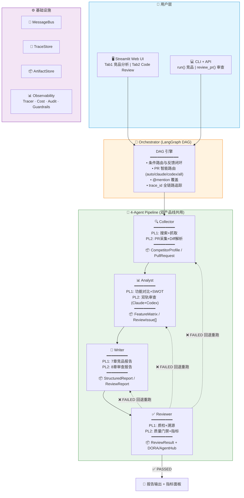

# 🔍 AI 驱动的竞品分析 & 代码审查 Agent 协作系统

[](https://github.com/quannie255-star/comprtitor-agent--system/actions)
[](https://www.python.org/downloads/)
[](https://github.com/quannie255-star/comprtitor-agent--system)
[](LICENSE)
[](https://github.com/quannie255-star/comprtitor-agent--system/releases)

基于 LangGraph 的多 Agent 协作系统，两条产品线共用 4-Agent Pipeline 基础设施：

| Product Line | 场景 | 入口 |
|-------------|------|------|
| **🔍 竞品分析** | 输入竞品名称 → 自动搜索采集 → 功能对比 → 报告输出 | Streamlit Tab 1 |
| **🔎 Code Review** | 提交 PR 数据 → Claude+Codex 双轨审查 → 质量门禁 → DORA 指标 | Streamlit Tab 2 |

---

## 架构概览



> **核心理念**: 4-Agent DAG 流水线是基础设施，竞品分析和代码审查是两条平行的业务产品线。新增产品线只需扩展各 Agent 的输入检测分支。

---

## 产品线详情

### PL1: 竞品分析

| Agent | 职责 | 输出 |
|---|---|---|
| Collector | Tavily 搜索 → 网页抓取 → LLM 结构化解析 | `CompetitorProfile` + Evidence |
| Analyst | 功能维度对比 + SWOT 分析 + 市场洞察 | `FeatureMatrix` + `MarketInsight` |
| Writer | 7 章节报告拼装 + Markdown 渲染 | `StructuredReport` |
| Reviewer | 编程化检查 + LLM 交叉审查 + 溯源验证 | `ReviewResult` + 条件路由 |

### PL2: Code Review（新增）

| Agent | 职责 | 输出 |
|---|---|---|
| Collector | PR 数据采集 + unified diff 解析 | `PullRequest` + FileChange[] |
| Analyst | Claude(架构/安全) + Codex(实现/测试) 双轨并行审查 | `ReviewIssue[]` + `ReviewScore` |
| Writer | 8 章节 Markdown 审查报告 | `ReviewReport` |
| Reviewer | 质量门禁判定 + DORA/AgentHub 七指标追踪 | `QualityGate` + `DORAMetrics` + `AgentHubMetrics` |

**智能路由**: <50 行 → Codex 轻量审查 / 50-200 行 → 双 Agent 标准审查 / >200 行 → 深度双轨审查 / `@claude` `@codex` `@all` 覆盖自动决策

**质量门禁**: overall≥6.0 + security≥7.0 + 零 critical issue → 通过 / overall≥8.5 + 零 critical + ≤1 high → 自动批准

---

## 快速开始

### 1. 安装

**方式 A：Docker 一键启动（推荐）**

```bash
git clone https://github.com/quannie255-star/comprtitor-agent--system.git
cd comprtitor-agent--system
cp .env.example .env          # 编辑 .env 填入 API Key（可选，无 Key 使用 Mock 模式）
docker compose up
```

浏览器访问 `http://localhost:8501`

**方式 B：pip 本地安装**

```bash
git clone https://github.com/quannie255-star/comprtitor-agent--system.git
cd comprtitor-agent--system
pip install -e ".[dev]"
```

### 2. 配置

```bash
cp .env.example .env

# 编辑 .env，填入 API Key（可选，无 Key 使用 Mock 模式）
# LLM_API_KEY=sk-xxx      # OpenAI / DeepSeek
# LLM_API_BASE=https://api.deepseek.com/v1  # 可选
# TAVILY_API_KEY=tvly-xxx # 搜索 API（竞品分析用）
```

### 3. 运行测试

```bash
python -m pytest tests/ -v          # 173 条测试
```

### 4. 命令行使用

**竞品分析**：
```python
from src.core.orchestrator import Orchestrator

orchestrator = Orchestrator({
    'llm': {'provider': 'openai', 'model': 'gpt-4o', 'api_key': ''},
    'storage': {'traces_dir': './traces', 'outputs_dir': './outputs', 'artifacts_dir': './artifacts'},
})

# 竞品分析
result = orchestrator.run('Notion', use_langgraph=False)
print(result['report'][:500])
```

**Code Review（Mock 模式，无需 API Key）**：
```python
result = orchestrator.review_pr({
    'title': 'Fix JWT token refresh bug',
    'description': 'Fixes token validation on each request.',
    'author': 'dev1',
    'changed_files': [
        {'path': 'src/auth.py', 'additions': 30, 'deletions': 8},
        {'path': 'tests/test_auth.py', 'additions': 45, 'deletions': 0},
    ],
    'total_additions': 75, 'total_deletions': 8,
})
print(result['report'][:500])
# 查看评分和指标
print(result['review_score'], result['dora_metrics'])
```

### 5. Streamlit 前端

```bash
streamlit run src/api/routes.py
```

浏览器访问 `http://localhost:8501`：
- **Tab 1 "🔍 竞品分析"** — 输入竞品名称，查看分析报告和溯源面板
- **Tab 2 "🔎 Code Review"** — 提交 PR 信息，查看双轨审查结果、评分仪表盘、DORA 指标

---

## 项目结构

```
├── config/
│   ├── settings.yaml         # 全局配置（LLM、搜索、Agent、Code Review 质量门禁）
│   └── agents.yaml           # Agent 角色定义与 Prompt 模板（含 PL2 审查 Prompt）
├── src/
│   ├── core/
│   │   ├── schema.py         # 共享 Schema（Pydantic V2）：PL1 竞品 + PL2 代码审查
│   │   ├── message_bus.py    # 发布/订阅消息总线
│   │   └── orchestrator.py   # DAG 编排引擎 + PR 智能路由
│   ├── agents/
│   │   ├── base.py           # Agent 基类（LLM 封装、工具注册、可观测性注入）
│   │   ├── collector.py      # 采集 Agent — PL1 搜索采集 / PL2 PR+diff 采集
│   │   ├── analyst.py        # 分析 Agent — PL1 SWOT 对比 / PL2 双轨审查
│   │   ├── writer.py         # 撰写 Agent — PL1 竞品报告 / PL2 审查报告
│   │   └── reviewer.py       # 质检 Agent — PL1 溯源审查 / PL2 质量门禁+指标
│   ├── tools/                # Tavily 搜索、网页抓取、数据结构化解析
│   ├── models/               # 分析模型（feature、market、report、review）
│   ├── storage/              # TraceStore + ArtifactStore 持久化
│   ├── observability/        # LLMTracer、CostTracker、AuditLogger、Guardrails
│   └── api/
│       └── routes.py         # Streamlit 前端（Tab1 竞品分析 + Tab2 Code Review）
├── tests/
│   ├── test_schema.py        # Schema 测试（23 条）
│   ├── test_collector.py     # Collector 测试（20 条）
│   ├── test_analyst.py       # Analyst 测试（12 条）
│   ├── test_writer.py        # Writer 测试（23 条）
│   ├── test_reviewer.py      # Reviewer 测试（27 条）
│   ├── test_orchestrator.py  # Orchestrator 测试（10 条）
│   ├── test_code_review.py   # Code Review 端到端测试（19 条）
│   └── ...                   # 基类 + 可观测性测试
├── outputs/                  # 生成的报告
├── traces/                   # 执行轨迹
├── artifacts/                # 中间产物
├── ARCHITECTURE.md           # 架构文档（Mermaid + ADR）
├── CHANGELOG.md
└── CLAUDE.md
```

---

## 技术栈

| 层级 | 技术 | 说明 |
|------|------|------|
| DAG 编排 | LangGraph | StateGraph + 条件路由 + 反馈闭环 |
| LLM 调用 | LangChain (OpenAI/DeepSeek/Anthropic) | 统一抽象层 |
| 数据模型 | Pydantic V2 | 竞品 Schema + 代码审查 Schema（30+ Model） |
| 搜索引擎 | Tavily API | 竞品分析信源采集 |
| 前端 | Streamlit | 双 Tab 界面 + 实时状态 |
| 可观测性 | LLMTracer / CostTracker / AuditLogger / Guardrails | 调用链、费用、审计、安全 |
| 测试 | Pytest | 173 条，覆盖正常 + 降级路径 |
| 容器化 | Docker + Compose | 一键部署 |
| CI/CD | GitHub Actions | test + lint + type check |

## License

MIT
