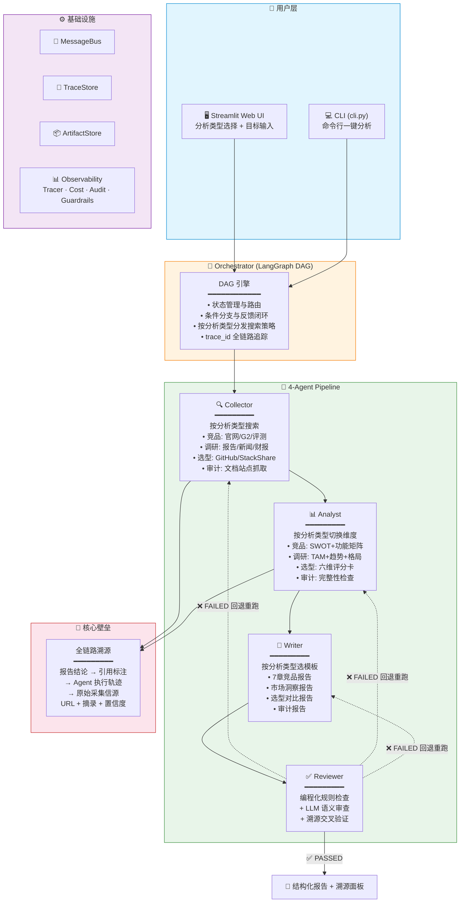

# 🔍 AI 驱动的自动化分析引擎

[](https://github.com/quannie255-star/comprtitor-agent--system/actions)
[](https://www.python.org/downloads/)
[](https://github.com/quannie255-star/comprtitor-agent--system)
[](LICENSE)
[](https://github.com/quannie255-star/comprtitor-agent--system/releases)

基于 LangGraph 的 **4-Agent 自动化分析引擎**。输入分析目标，系统自动完成搜索采集 → 多维分析 → 报告撰写 → 质检审查全链路。**报告中每条结论都可追溯到原始信源 URL + 摘录 + 置信度**。

### 支持的分析类型

| 类型 | 输入示例 | 输出 | 适用场景 |
|------|---------|------|---------|
| 🔍 **竞品分析** | Notion, 飞书 | 功能矩阵 + SWOT + 定价对比 | 产品经理 |
| 📊 **市场调研** | AI 代码审查工具市场 | TAM/SAM + 格局 + 趋势 | 战略部门 |
| ⚙️ **技术选型** | React vs Vue 2026 | 功能/性能/社区/成熟度评分 | 技术负责人 |
| 📋 **文档审计** | https://docs.example.com | 完整性/准确性/一致性报告 | 技术写作 |

---

## 架构概览



> **核心壁垒**：不是"生成一份报告"，而是"每句话都能追溯到原始信源"——4 层溯源链路（报告引用 → 参考来源 → Agent 轨迹 → 原始数据）。

---

## 快速开始

### 1. 安装

```bash
git clone https://github.com/quannie255-star/comprtitor-agent--system.git
cd comprtitor-agent--system
cp .env.example .env          # 编辑 .env 填入 API Key（可选，无 Key 使用 Mock 模式）
docker compose up
```

浏览器访问 `http://localhost:8501`

### 2. 命令行使用

```python
from src.core.orchestrator import Orchestrator

config = {
    'llm': {'provider': 'openai', 'model': 'gpt-4o', 'api_key': ''},
    'storage': {'traces_dir': './traces', 'outputs_dir': './outputs', 'artifacts_dir': './artifacts'},
}

orchestrator = Orchestrator(config)

# 竞品分析
result = orchestrator.run('Notion', analysis_type='competitor')

# 市场调研
result = orchestrator.run('AI代码审查工具市场', analysis_type='market_research')

# 技术选型
result = orchestrator.run('React vs Vue 2026', analysis_type='tech_evaluation')

# 文档审计
result = orchestrator.run('https://docs.example.com', analysis_type='doc_audit')

print(result['report'][:500])
```

### 3. Streamlit 前端

```bash
streamlit run src/api/routes.py
```

选分析类型 → 输入目标 → 点击开始分析。报告中的 `[src_xxx]` 标注可点击溯源。

---

## 项目结构

```
├── config/
│   ├── settings.yaml         # 全局配置（LLM、搜索、Agent 编排）
│   └── agents.yaml           # 4 种分析类型的 Prompt + 维度定义
├── src/
│   ├── core/
│   │   ├── schema.py         # 共享 Schema（Pydantic V2, 30+ Model）
│   │   ├── message_bus.py    # 发布/订阅消息总线
│   │   └── orchestrator.py   # DAG 编排引擎（LangGraph + 顺序 fallback）
│   ├── agents/
│   │   ├── base.py           # Agent 基类（LLM 封装、工具注册、可观测性）
│   │   ├── collector.py      # 采集 Agent — 按分析类型切换搜索策略
│   │   ├── analyst.py        # 分析 Agent — 按分析类型切换分析维度
│   │   ├── writer.py         # 撰写 Agent — 按分析类型切换报告模板
│   │   └── reviewer.py       # 质检 Agent — 交叉审查 + 溯源验证
│   ├── tools/                # Tavily 搜索、网页抓取、数据解析
│   ├── models/               # 分析模型（feature、market、report、review）
│   ├── storage/              # TraceStore + ArtifactStore
│   ├── observability/        # LLMTracer、CostTracker、AuditLogger、Guardrails
│   └── api/
│       └── routes.py         # Streamlit 前端
├── tests/                    # 173 条测试
├── ARCHITECTURE.md           # 架构文档（Mermaid + 3 ADR）
└── CHANGELOG.md
```

---

## 技术栈

| 层级 | 技术 | 说明 |
|------|------|------|
| DAG 编排 | LangGraph | StateGraph + 条件路由 + 反馈闭环 |
| LLM 调用 | LangChain (OpenAI/DeepSeek/Anthropic) | 统一抽象层 |
| 数据模型 | Pydantic V2 | 30+ Model，字段级溯源 |
| 搜索引擎 | Tavily API | 按分析类型切换搜索策略 |
| 前端 | Streamlit | 分析类型选择 + 溯源高亮 |
| 可观测性 | Tracer / Cost / Audit / Guardrails | 全链路追踪 |
| 测试 | Pytest | 173 条，覆盖正常 + 降级路径 |

## License

MIT
